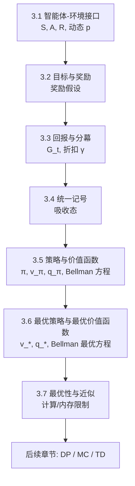
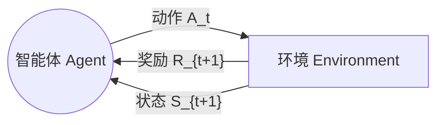
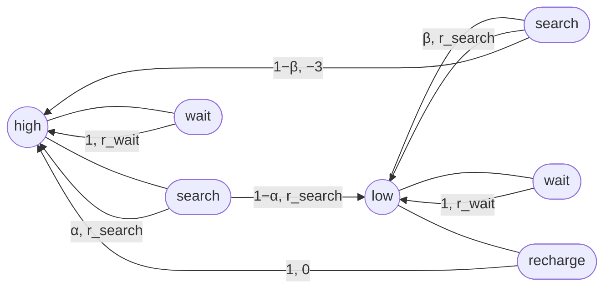
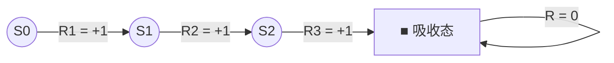
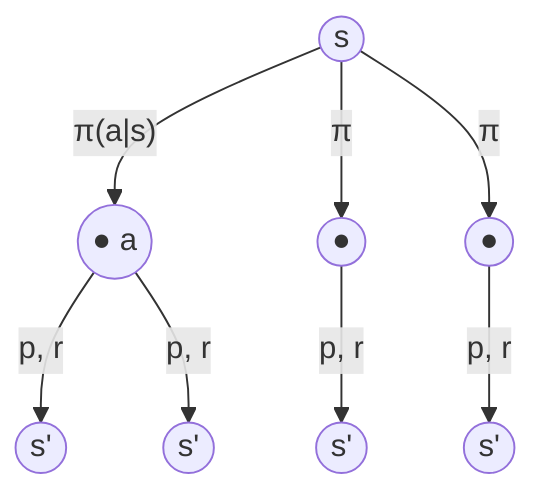
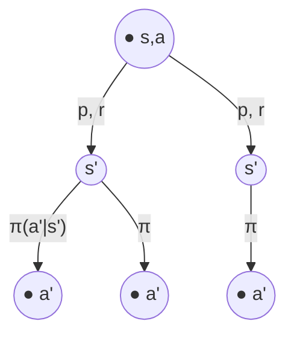
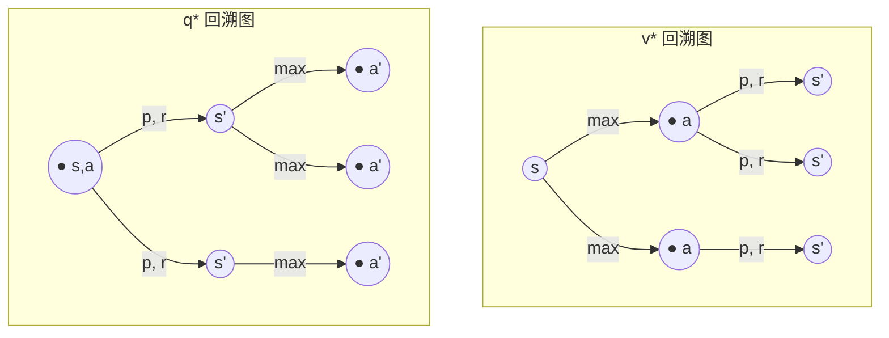
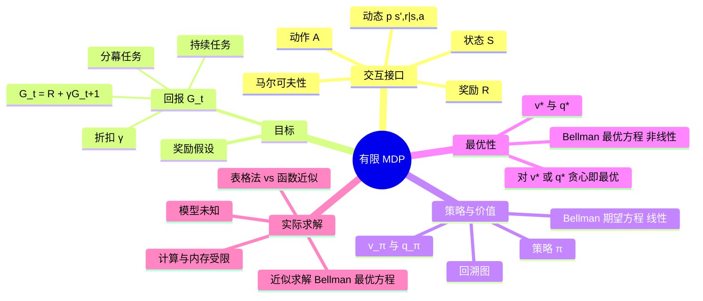

# 第三章 有限马尔可夫决策过程（Finite MDPs）梳理

> 教材：Sutton & Barto《Reinforcement Learning: An Introduction》(2nd ed., 2020)，第 3 章，p.47–69

---

## 0. 本章定位与全局结构

第二章的多臂赌博机只有**评价性反馈**，没有"状态"。第三章引入 **MDP**，增加了两个关键要素：

1. **关联性（associative）**：不同状态下应选择不同动作；
2. **延迟奖励（delayed reward）**：动作不仅影响即时奖励，还影响后续状态，从而影响未来奖励。

因此需要在"即时奖励"与"延迟奖励"之间权衡。估计对象也从赌博机中的 $q_*(a)$ 变为 $q_*(s,a)$ 或 $v_*(s)$。

---

## 3.1 智能体–环境接口（The Agent–Environment Interface）

### 3.1.1 基本交互

- **智能体（agent）**：学习者与决策者。
- **环境（environment）**：智能体之外的一切。
- 在离散时刻 $t=0,1,2,\dots$：
  - 智能体观察状态 $S_t \in \mathcal{S}$；
  - 选择动作 $A_t \in \mathcal{A}(s)$；
  - 下一时刻获得奖励 $R_{t+1}\in\mathcal{R}\subset\mathbb{R}$，并进入新状态 $S_{t+1}$。

产生的**轨迹（trajectory）**：

$$
S_0, A_0, R_1, S_1, A_1, R_2, S_2, A_2, R_3, \dots
$$

> 记号说明：书中用 $R_{t+1}$（而非 $R_t$）表示由 $A_t$ 引起的奖励，强调 $R_{t+1}$ 与 $S_{t+1}$ 是**联合决定**的。

### 3.1.2 动态函数（Dynamics）

**有限 MDP**：$\mathcal{S},\mathcal{A},\mathcal{R}$ 都是有限集合。此时环境动态由四参数函数完全刻画：

$$
p(s', r \mid s, a) \doteq \Pr\{S_t = s', R_t = r \mid S_{t-1}=s, A_{t-1}=a\} \tag{3.2}
$$

满足归一化：

$$
\sum_{s'\in\mathcal{S}}\sum_{r\in\mathcal{R}} p(s', r\mid s,a) = 1,\quad \forall s\in\mathcal{S}, a\in\mathcal{A}(s) \tag{3.3}
$$

$p:\mathcal{S}\times\mathcal{R}\times\mathcal{S}\times\mathcal{A}\to[0,1]$ 只是一个普通的四元确定性函数，"$\mid$" 仅提醒它对每个 $(s,a)$ 定义了一个概率分布。

### 3.1.3 马尔可夫性（Markov Property）

$S_t, R_t$ 的分布**只依赖**于前一时刻的 $S_{t-1}, A_{t-1}$，与更早历史无关。

- 这应理解为**对状态的要求**，而不是对决策过程的限制：状态必须包含过去交互中所有对未来有影响的信息。
- 本书默认满足马尔可夫性；第 II 部分的近似方法不依赖它；第 17 章讨论如何从非马尔可夫观测构造马尔可夫状态。

### 3.1.4 由 $p$ 导出的常用量

**状态转移概率**（三参数）：

$$
p(s'\mid s,a) \doteq \Pr\{S_t=s'\mid S_{t-1}=s,A_{t-1}=a\} = \sum_{r\in\mathcal{R}} p(s',r\mid s,a) \tag{3.4}
$$

**状态–动作期望奖励**（二参数）：

$$
r(s,a) \doteq \mathbb{E}[R_t\mid S_{t-1}=s,A_{t-1}=a] = \sum_{r\in\mathcal{R}} r\sum_{s'\in\mathcal{S}} p(s',r\mid s,a) \tag{3.5}
$$

**状态–动作–下一状态期望奖励**（三参数）：

$$
r(s,a,s') \doteq \mathbb{E}[R_t\mid S_{t-1}=s,A_{t-1}=a,S_t=s'] = \sum_{r\in\mathcal{R}} r\,\frac{p(s',r\mid s,a)}{p(s'\mid s,a)} \tag{3.6}
$$

### 3.1.5 框架的灵活性与"边界"

- **时间步**不必是固定的物理时间间隔，可以是任意的决策阶段。
- **动作**可低层（电机电压）也可高层（是否读研）；甚至可以是"心理"动作（注意力分配）。
- **状态**可以是传感器读数，也可以是抽象符号、记忆，甚至主观状态（如"不确定物体在哪"）。
- **智能体–环境边界**：
  - 规则：**凡智能体不能任意改变的东西，都属于环境**。
  - 机器人的电机、传感器、人的肌肉骨骼都算环境。
  - 奖励的计算也视为在环境中（否则智能体可以随意修改自己的目标）。
  - 边界代表的是智能体**绝对控制**的极限，而**不是知识**的极限（例：知道魔方规则仍然可能解不开）。
  - 复杂系统中可有多个智能体、多层边界（高层决策构成低层智能体的状态的一部分）。

**核心抽象**：任何目标导向的交互学习问题都可以化约为三种信号：

| 信号 | 含义 |
|---|---|
| 动作 $A_t$ | 智能体做出的选择 |
| 状态 $S_t$ | 做选择的依据 |
| 奖励 $R_t$ | 定义智能体的目标 |

### 3.1.6 例子

**例 3.1 生物反应器**：动作 = 目标温度与搅拌速率（传给底层控制器）；状态 = 热电偶等传感器读数 + 原料/目标化学品的符号输入；奖励 = 有用化学品的即时生产速率。
→ 状态和动作常为**结构化向量**，而奖励**永远是单个标量**。

**例 3.2 抓放机器人**：动作 = 各关节电机电压；状态 = 关节角度与速度；奖励 = 每成功抓放一次 $+1$，另加一个与动作"抖动"程度相关的小负奖励，以鼓励平滑运动。

**例 3.3 回收机器人（Recycling Robot）** —— 本章贯穿性例子

- 状态：$\mathcal{S}=\{\text{high},\text{low}\}$（电量高/低）
- 动作：$\mathcal{A}(\text{high})=\{\text{search},\text{wait}\}$，$\mathcal{A}(\text{low})=\{\text{search},\text{wait},\text{recharge}\}$
- 参数：
  - high 下 search：以概率 $\alpha$ 仍为 high，$1-\alpha$ 变为 low；
  - low 下 search：以概率 $\beta$ 仍为 low，$1-\beta$ 耗尽电量 → 需被救援（奖励 $-3$），随后充满回到 high；
  - $r_{\text{search}} > r_{\text{wait}}$ 分别为搜索/等待时期望收集罐子数；
  - 回家充电和电量耗尽的那一步不收集罐子。

转移表：

| $s$ | $a$ | $s'$ | $p(s'\mid s,a)$ | $r(s,a,s')$ |
|---|---|---|---|---|
| high | search | high | $\alpha$ | $r_{\text{search}}$ |
| high | search | low | $1-\alpha$ | $r_{\text{search}}$ |
| low | search | high | $1-\beta$ | $-3$ |
| low | search | low | $\beta$ | $r_{\text{search}}$ |
| high | wait | high | $1$ | $r_{\text{wait}}$ |
| high | wait | low | $0$ | – |
| low | wait | high | $0$ | – |
| low | wait | low | $1$ | $r_{\text{wait}}$ |
| low | recharge | high | $1$ | $0$ |
| low | recharge | low | $0$ | – |

转移图（大节点 = 状态节点，小节点 = 动作节点）：

> 从同一个动作节点出发的所有箭头的概率之和为 1。

---

## 3.2 目标与奖励（Goals and Rewards）

### 奖励假设（Reward Hypothesis）

> 我们所说的一切"目标"和"目的"，都可以很好地理解为：**最大化所接收标量信号（称为奖励）累积和的期望值**。

这是强化学习最具特色的地方之一：用一个标量奖励信号形式化"目标"。

### 奖励设计举例

| 任务 | 奖励设计 |
|---|---|
| 机器人学走路 | 每步奖励 ∝ 前进距离 |
| 走出迷宫 | 逃出前每步 $-1$（鼓励尽快逃出） |
| 收集易拉罐 | 平时 $0$，每收集一个 $+1$；撞东西或被骂给负奖励 |
| 下棋 | 赢 $+1$，输 $-1$，平局和非终局 $0$ |

### 关键原则

- 奖励要**真正反映我们希望达成的事**。
- 奖励信号**不是**传递"如何做"的先验知识的地方。
  - 反例：象棋中若奖励"吃子"或"控制中心"，智能体可能为了吃子而输棋。
  - 先验知识更适合放在**初始策略**或**初始价值函数**里。
- 一句话：**奖励告诉智能体"要达成什么（what）"，而不是"怎么达成（how）"**。

---

## 3.3 回报与分幕（Returns and Episodes）

### 3.3.1 回报 $G_t$

目标是最大化**期望回报**，回报 $G_t$ 是之后奖励序列的某个函数。

**分幕任务（episodic tasks）**：交互自然分为若干**幕（episode）**，如一局游戏、一次走迷宫。每幕在**终止状态**结束，然后重置。

$$
G_t \doteq R_{t+1} + R_{t+2} + R_{t+3} + \cdots + R_T \tag{3.7}
$$

- $T$ 为终止时刻，是一个随机变量。
- $\mathcal{S}$：非终止状态集合；$\mathcal{S}^+$：包含终止状态的全集。

**持续任务（continuing tasks）**：交互无限进行（如长期过程控制）。此时 $T=\infty$，式 (3.7) 可能发散。

### 3.3.2 折扣回报

引入**折扣率** $0\le\gamma\le 1$：

$$
G_t \doteq R_{t+1} + \gamma R_{t+2} + \gamma^2 R_{t+3} + \cdots = \sum_{k=0}^{\infty}\gamma^k R_{t+k+1} \tag{3.8}
$$

- $k$ 步后的奖励只值当下的 $\gamma^{k-1}$ 倍。
- $\gamma<1$ 且奖励有界 ⇒ 无穷和收敛。
- $\gamma=0$：**短视（myopic）**，只关心 $R_{t+1}$。
- $\gamma\to 1$：**远视（farsighted）**，更重视未来奖励。

### 3.3.3 回报的递归关系（非常重要）

$$
\begin{aligned}
G_t &= R_{t+1} + \gamma R_{t+2} + \gamma^2 R_{t+3} + \cdots \\
&= R_{t+1} + \gamma\left(R_{t+2} + \gamma R_{t+3} + \cdots\right) \\
&= R_{t+1} + \gamma G_{t+1}
\end{aligned} \tag{3.9}
$$

对所有 $t<T$ 成立（约定 $G_T=0$）。这是后续 Bellman 方程和 TD 学习的基础。

常数奖励 $+1$ 时：

$$
G_t = \sum_{k=0}^{\infty}\gamma^k = \frac{1}{1-\gamma} \tag{3.10}
$$

### 3.3.4 例 3.4 倒立摆（Pole-Balancing）

| 建模方式 | 奖励 | 回报含义 |
|---|---|---|
| 分幕、不折扣 | 每步未失败 $+1$ | 失败前的步数（永远平衡则为 $\infty$） |
| 持续、折扣 | 失败时 $-1$，其余 $0$ | $-\gamma^{K-1}$，$K$ 为距失败步数 |

两种方式下，回报都通过"尽量长时间保持平衡"来最大化。

> 思考（练习 3.7）：走迷宫只在逃出时给 $+1$、不折扣，则无论多慢逃出回报都是 1，智能体没有动力变快 → 需加折扣或每步 $-1$。

---

## 3.4 分幕与持续任务的统一记号

- 严格说分幕任务应写 $S_{t,i}$（第 $i$ 幕第 $t$ 步），但实际几乎总省略幕编号，直接写 $S_t$。
- **统一方法**：把"终止"视为进入一个特殊的**吸收状态（absorbing state）**，它只转移到自身，且奖励恒为 0。

奖励序列 $+1,+1,+1,0,0,0,\dots$，无论对前 $T$ 项求和还是对无穷序列求和（含折扣），结果相同。统一写法：

$$
G_t \doteq \sum_{k=t+1}^{T}\gamma^{k-t-1}R_k \tag{3.11}
$$

允许 $T=\infty$ **或** $\gamma=1$，但**不能同时成立**。

> 第 10 章还会介绍"持续且不折扣"的平均奖励形式。

---

## 3.5 策略与价值函数（Policies and Value Functions）

### 3.5.1 策略

**策略** $\pi$：从状态到动作选择概率的映射。

$$
\pi(a\mid s) = \Pr\{A_t = a \mid S_t = s\}
$$

强化学习方法描述的就是智能体如何根据经验改变其策略。

### 3.5.2 状态价值函数 $v_\pi$

在状态 $s$ 下、之后遵循策略 $\pi$ 的期望回报：

$$
v_\pi(s) \doteq \mathbb{E}_\pi[G_t\mid S_t=s] = \mathbb{E}_\pi\left[\sum_{k=0}^{\infty}\gamma^k R_{t+k+1}\,\Big|\, S_t=s\right],\quad \forall s\in\mathcal{S} \tag{3.12}
$$

终止状态的价值恒为 0。

### 3.5.3 动作价值函数 $q_\pi$

在状态 $s$ 采取动作 $a$，之后遵循 $\pi$ 的期望回报：

$$
q_\pi(s,a) \doteq \mathbb{E}_\pi[G_t\mid S_t=s, A_t=a] = \mathbb{E}_\pi\left[\sum_{k=0}^{\infty}\gamma^k R_{t+k+1}\,\Big|\, S_t=s, A_t=a\right] \tag{3.13}
$$

### 3.5.4 $v_\pi$ 与 $q_\pi$ 的相互关系（练习 3.12、3.13）

$$
v_\pi(s) = \sum_{a}\pi(a\mid s)\,q_\pi(s,a)
$$

$$
q_\pi(s,a) = \sum_{s',r}p(s',r\mid s,a)\big[r+\gamma v_\pi(s')\big]
$$

### 3.5.5 估计方法简述

- **蒙特卡洛方法**：对每个状态记录实际回报的平均，次数足够多时收敛到 $v_\pi(s)$；对每个状态–动作对分别平均则收敛到 $q_\pi(s,a)$（第 5 章）。
- 状态太多时，用**参数化函数**近似 $v_\pi, q_\pi$（第 II 部分）。

### 3.5.6 $v_\pi$ 的 Bellman 方程

利用递归关系 (3.9)：

$$
\begin{aligned}
v_\pi(s) &\doteq \mathbb{E}_\pi[G_t\mid S_t=s] \\
&= \mathbb{E}_\pi[R_{t+1}+\gamma G_{t+1}\mid S_t=s] \\
&= \sum_a \pi(a\mid s)\sum_{s'}\sum_r p(s',r\mid s,a)\Big[r+\gamma\,\mathbb{E}_\pi[G_{t+1}\mid S_{t+1}=s']\Big] \\
&= \sum_a \pi(a\mid s)\sum_{s',r} p(s',r\mid s,a)\big[r+\gamma v_\pi(s')\big],\quad \forall s\in\mathcal{S}
\end{aligned} \tag{3.14}
$$

**理解**：某状态的价值 = 对所有可能 (动作, 下一状态, 奖励) 按概率加权的 "即时奖励 + 折扣后的下一状态价值"。

- $v_\pi$ 是该方程的**唯一解**。
- 这是一个关于 $|\mathcal{S}|$ 个未知数的**线性方程组**。

### 3.5.7 回溯图（Backup Diagram）

回溯（backup）指把后继状态的价值信息"传回"当前状态。

$v_\pi$ 的回溯图（空心圆 = 状态，实心圆 = 状态-动作对）：

$q_\pi$ 的回溯图（练习 3.17 对应的 Bellman 方程）：

$$
q_\pi(s,a) = \sum_{s',r}p(s',r\mid s,a)\Big[r+\gamma\sum_{a'}\pi(a'\mid s')\,q_\pi(s',a')\Big]
$$

### 3.5.8 例 3.5 网格世界（Gridworld）

- $5\times5$ 网格，动作：上下左右，确定性移动。
- 撞墙：位置不变，奖励 $-1$。
- 在 A 处任意动作：奖励 $+10$，传送到 A'。
- 在 B 处任意动作：奖励 $+5$，传送到 B'。
- 其余动作奖励 $0$；$\gamma=0.9$，策略为等概率随机。

结果要点（图 3.2 右）：

- 下边缘附近价值为负（随机策略容易撞墙）。
- A 的价值 $\approx 8.8 < 10$：因为 A' 靠近边缘，之后容易撞墙。
- B 的价值 $> 5$：因为 B' 附近的状态价值为正（B' 离 A/B 不远）。

### 3.5.9 奖励的平移（练习 3.15、3.16）

- **持续任务**：所有奖励加常数 $c$，每个状态价值增加 $v_c=\dfrac{c}{1-\gamma}$，**不改变**各状态的相对大小，因此奖励符号本身不重要，重要的是相对差值。
- **分幕任务**：加常数 $c$ 会改变任务——因为幕长度不同，累加的 $c$ 次数不同（如迷宫中每步 $+c$ 会鼓励拖延）。

### 3.5.10 例 3.6 高尔夫（Golf）

- 每杆奖励 $-1$，直到进洞；状态 = 球的位置；动作 = 选择球杆（推杆 putter 或木杆 driver）。
- 只用推杆时，$v_{\text{putt}}$ 的等高线：果岭上 $-1$，每远一段推杆距离 $-1$；沙坑中为 $-\infty$（推杆打不出沙坑）。

---

## 3.6 最优策略与最优价值函数

### 3.6.1 策略的偏序

$$
\pi \ge \pi' \iff v_\pi(s)\ge v_{\pi'}(s),\quad \forall s\in\mathcal{S}
$$

总存在至少一个策略不劣于所有其他策略，即**最优策略** $\pi_*$（可能不唯一）。

### 3.6.2 最优价值函数

$$
v_*(s) \doteq \max_\pi v_\pi(s),\quad \forall s\in\mathcal{S} \tag{3.15}
$$

$$
q_*(s,a) \doteq \max_\pi q_\pi(s,a),\quad \forall s\in\mathcal{S},a\in\mathcal{A}(s) \tag{3.16}
$$

所有最优策略共享同一个 $v_*$ 和 $q_*$。二者关系：

$$
q_*(s,a) = \mathbb{E}\big[R_{t+1}+\gamma v_*(S_{t+1})\mid S_t=s, A_t=a\big] \tag{3.17}
$$

**例 3.7（高尔夫最优价值）**：$q_*(s,\text{driver})$ 表示先用木杆、之后都选最好球杆时的价值；木杆可以打得更远（甚至越过沙坑），只有在很靠近洞时才用推杆。

### 3.6.3 Bellman 最优方程（Bellman Optimality Equation）

**关键思想**：最优策略下，状态价值必须等于该状态下**最好动作**的期望回报。

$v_*$ 的 Bellman 最优方程：

$$
\begin{aligned}
v_*(s) &= \max_{a\in\mathcal{A}(s)} q_{\pi_*}(s,a) \\
&= \max_a \mathbb{E}_{\pi_*}[G_t\mid S_t=s,A_t=a] \\
&= \max_a \mathbb{E}_{\pi_*}[R_{t+1}+\gamma G_{t+1}\mid S_t=s,A_t=a] \\
&= \max_a \mathbb{E}[R_{t+1}+\gamma v_*(S_{t+1})\mid S_t=s,A_t=a] \qquad (3.18) \\
&= \max_a \sum_{s',r}p(s',r\mid s,a)\big[r+\gamma v_*(s')\big] \qquad (3.19)
\end{aligned}
$$

$q_*$ 的 Bellman 最优方程：

$$
\begin{aligned}
q_*(s,a) &= \mathbb{E}\Big[R_{t+1}+\gamma\max_{a'}q_*(S_{t+1},a')\,\Big|\,S_t=s,A_t=a\Big] \\
&= \sum_{s',r}p(s',r\mid s,a)\Big[r+\gamma\max_{a'}q_*(s',a')\Big]
\end{aligned} \tag{3.20}
$$

**与 Bellman 期望方程的区别**：把"按 $\pi$ 加权平均"换成了"取 $\max$"。因此它是**非线性**方程组；对有限 MDP 有唯一解。

回溯图（在"选择动作"处取最大值，用圆弧表示）：

### 3.6.4 由最优价值函数得到最优策略

**已知 $v_*$**：
- 在每个状态中，使 Bellman 最优方程取到最大值的动作即为最优动作；
- 对 $v_*$ **贪心（greedy）** 的策略就是最优策略。
- 妙处：只需**一步搜索（one-step search）**，因为 $v_*$ 已经把所有未来的长期后果都"缓存"进来了——短期贪心即长期最优。

**已知 $q_*$**：更简单，连一步搜索都不需要，直接

$$
\pi_*(s) = \arg\max_{a} q_*(s,a)
$$

且**不需要知道环境动态** $p$。代价是需要存储状态–动作对的函数。

$v_*$ 与 $q_*$ 的互相表示（练习 3.25、3.26）：

$$
v_*(s) = \max_a q_*(s,a),\qquad
q_*(s,a) = \sum_{s',r}p(s',r\mid s,a)\big[r+\gamma v_*(s')\big]
$$

### 3.6.5 例 3.8 求解网格世界

解 $v_*$ 的 Bellman 最优方程后（图 3.5）：

- $v_*(A)\approx 24.4$（对比随机策略的 8.8）。
- 最优策略：从各处尽快走向 A，拿 $+10$ 后被传到 A'，再尽快走回 A，循环往复。
- 验证（练习 3.24）：从 A 出发，每 5 步获得一次 $+10$：

$$
v_*(A) = \sum_{k=0}^{\infty}10\gamma^{5k} = \frac{10}{1-\gamma^5} = \frac{10}{1-0.9^5}\approx 24.419
$$

### 3.6.6 例 3.9 回收机器人的 Bellman 最优方程

记 h = high，l = low，s = search，w = wait，re = recharge：

$$
\begin{aligned}
v_*(\text{h}) = \max\Big\{ &\; r_{\text{s}} + \gamma\big[\alpha v_*(\text{h}) + (1-\alpha)v_*(\text{l})\big], \\
&\; r_{\text{w}} + \gamma v_*(\text{h}) \Big\}
\end{aligned}
$$

$$
\begin{aligned}
v_*(\text{l}) = \max\Big\{ &\; \beta r_{\text{s}} - 3(1-\beta) + \gamma\big[(1-\beta)v_*(\text{h}) + \beta v_*(\text{l})\big], \\
&\; r_{\text{w}} + \gamma v_*(\text{l}), \\
&\; \gamma v_*(\text{h}) \Big\}
\end{aligned}
$$

给定 $r_{\text{s}}, r_{\text{w}}, \alpha, \beta, \gamma$，恰好有一对 $v_*(\text{h}), v_*(\text{l})$ 同时满足上述两个非线性方程。

### 3.6.7 直接求解的局限

显式求解 Bellman 最优方程 ≈ 穷举搜索所有可能，依赖三个很少同时满足的假设：

1. **准确知道环境动态** $p$；
2. **计算资源足够**；
3. **马尔可夫性**成立。

例如双陆棋（backgammon）约有 $10^{20}$ 个状态，即使知道规则也无法直接求解。因此许多 RL 方法可以理解为**近似求解 Bellman 最优方程**：

| 方法 | 如何近似 |
|---|---|
| 启发式搜索 | 把 (3.19) 右侧展开若干层形成搜索树，叶子用启发式估值 |
| 动态规划 DP（第 4 章） | 已知模型，迭代求解 |
| 强化学习（MC/TD 等） | 用**实际经验的转移**代替期望转移 |

---

## 3.7 最优性与近似（Optimality and Approximation）

- 真正的最优策略只能以**极大的计算代价**获得，实际中智能体一般无法学到。
- 关键约束：
  - **每步可用计算量**有限；
  - **内存**有限：
    - 小规模、有限状态 → **表格法（tabular case）**，每个状态/状态-动作对一个表项；
    - 大规模状态 → 必须使用**参数化函数近似**。
- **近似带来的机会**：很多状态极少出现，在这些状态上选差动作对总奖励影响很小。
- 强化学习的**在线**特性可以把更多学习精力放在**频繁遇到**的状态上，而少遇到的状态可以粗糙处理。
  - 例：TD-Gammon 下棋水平极高，但对从未见过的棋局可能判断很差。
- 这是 RL 区别于其他近似求解 MDP 方法的重要特点。

---

## 3.8 本章小结

核心要点回顾：

1. **RL 问题 = 智能体通过与环境交互来学习如何行动以实现目标**；MDP 用状态、动作、奖励三种信号形式化它。
2. **策略** $\pi$ 是智能体选择动作的随机规则；目标是最大化**期望回报**。
3. **回报**：分幕任务用不折扣和，持续任务用折扣和；通过**吸收态**统一为 $G_t=\sum_{k=t+1}^{T}\gamma^{k-t-1}R_k$。
4. **价值函数** $v_\pi, q_\pi$ 给出遵循 $\pi$ 的期望回报；**最优价值函数** $v_*, q_*$ 是所有策略中的最大者。
5. $v_*, q_*$ 满足**Bellman 最优方程**，对它们贪心的策略就是最优策略。
6. 已知模型 → 可以规划（DP）；未知模型 → 需要从经验中学习。
7. 现实中通常无法精确求解，只能**近似**，这正是后续章节的主线。

---

## 附：本章公式速查表

| 名称 | 公式 |
|---|---|
| 动态函数 | $p(s',r\mid s,a)=\Pr\{S_t=s',R_t=r\mid S_{t-1}=s,A_{t-1}=a\}$ |
| 折扣回报 | $G_t=\sum_{k=0}^{\infty}\gamma^kR_{t+k+1}$ |
| 回报递归 | $G_t=R_{t+1}+\gamma G_{t+1}$ |
| 状态价值 | $v_\pi(s)=\mathbb{E}_\pi[G_t\mid S_t=s]$ |
| 动作价值 | $q_\pi(s,a)=\mathbb{E}_\pi[G_t\mid S_t=s,A_t=a]$ |
| $v_\pi$ Bellman 方程 | $v_\pi(s)=\sum_a\pi(a\mid s)\sum_{s',r}p(s',r\mid s,a)[r+\gamma v_\pi(s')]$ |
| $q_\pi$ Bellman 方程 | $q_\pi(s,a)=\sum_{s',r}p(s',r\mid s,a)[r+\gamma\sum_{a'}\pi(a'\mid s')q_\pi(s',a')]$ |
| $v_*$ 最优方程 | $v_*(s)=\max_a\sum_{s',r}p(s',r\mid s,a)[r+\gamma v_*(s')]$ |
| $q_*$ 最优方程 | $q_*(s,a)=\sum_{s',r}p(s',r\mid s,a)[r+\gamma\max_{a'}q_*(s',a')]$ |
| 最优策略 | $\pi_*(s)=\arg\max_a q_*(s,a)$ |

## 附：本章专业术语中英对照

| 中文 | English |
|---|---|
| 马尔可夫决策过程 | Markov Decision Process (MDP) |
| 智能体 / 环境 | agent / environment |
| 轨迹 | trajectory |
| 动态（函数） | dynamics |
| 马尔可夫性 | Markov property |
| 回报 | return |
| 幕 / 分幕任务 / 持续任务 | episode / episodic task / continuing task |
| 折扣率 | discount rate |
| 吸收状态 | absorbing state |
| 策略 | policy |
| 状态价值函数 / 动作价值函数 | state-value / action-value function |
| 贝尔曼方程 / 贝尔曼最优方程 | Bellman equation / Bellman optimality equation |
| 回溯图 | backup diagram |
| 贪心 | greedy |
| 表格型方法 | tabular methods |
